<p align="center">
  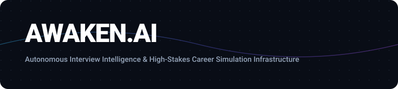
</p>

<p align="center">
  
  
  
  
  
</p>

---

## Technical Index

- [1. Architectural Foundation](#1-architectural-foundation)
- [2. Multi-Agent Topology & Neural Dispatch](#2-multi-agent-topology--neural-dispatch)
- [3. Full System Interaction Flow](#3-full-system-interaction-flow)
- [4. Deterministic ATS Scoring Equation & Weights](#4-deterministic-ats-scoring-equation--weights)
- [5. Module Matrix & Functional Specifications](#5-module-matrix--functional-specifications)
- [6. High-Frequency Interview Vault Architecture](#6-high-frequency-interview-vault-architecture)
- [7. Dual-Engine Data Storage Topology](#7-dual-engine-data-storage-topology)
- [8. Hardware & Browser Media Pipeline](#8-hardware--browser-media-pipeline)
- [9. Quick Start & Execution Modes](#9-quick-start--execution-modes)
- [10. Production Deployment Specifications](#10-production-deployment-specifications)

---

## 1. Architectural Foundation

Awaken.ai is built as a dual-tier distributed interview coaching engine. It decouples high-throughput client-side audio/video processing from deterministic evaluation pipelines and distributed AI inference nodes.

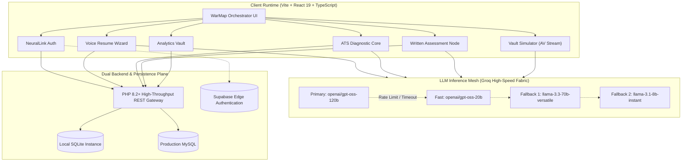

---

## 2. Multi-Agent Topology & Neural Dispatch

The platform coordinates five specialized neural agents configured with distinct system prompts, operational tones, and domain tasks:

<p align="center">
  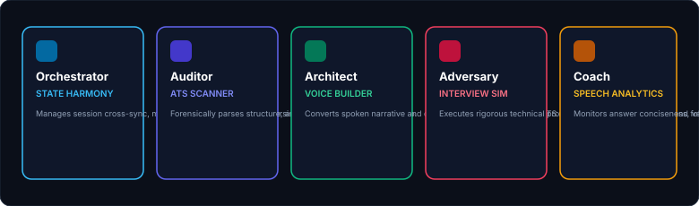
</p>

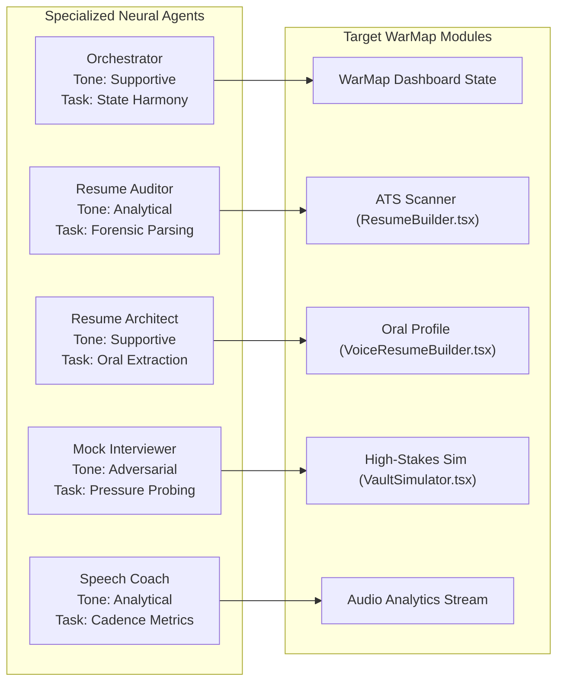

| Agent Identifier | Tactical Persona | Operational Tone | Primary Functionality | Core Dependency |
| :--- | :--- | :--- | :--- | :--- |
| `orchestrator` | System Orchestrator | Supportive | Synchronizes telemetry across all 9 WarMap tabs | `src/lib/agents.ts` |
| `forensic_auditor` | Resume Auditor | Analytical | Deconstructs resumes to compute structural & skill gaps | `src/lib/atsAlgorithm.ts` |
| `resume_architect` | Resume Architect | Supportive | Synthesizes oral responses into high-density ATS bullets | `src/lib/groq.ts` |
| `vault_adversary` | Mock Interviewer | Adversarial | Runs multi-turn high-stakes technical interrogation | `src/components/VaultSimulator.tsx` |
| `comm_coach` | Speech Coach | Analytical | Evaluates audio cadence, latency, and pacing metrics | Web Speech Recognition API |

---

## 3. Full System Interaction Flow

The operational sequence illustrates how a candidate authenticates, conducts an ATS analysis, undergoes a simulated interview round, and compiles an executive evaluation report:

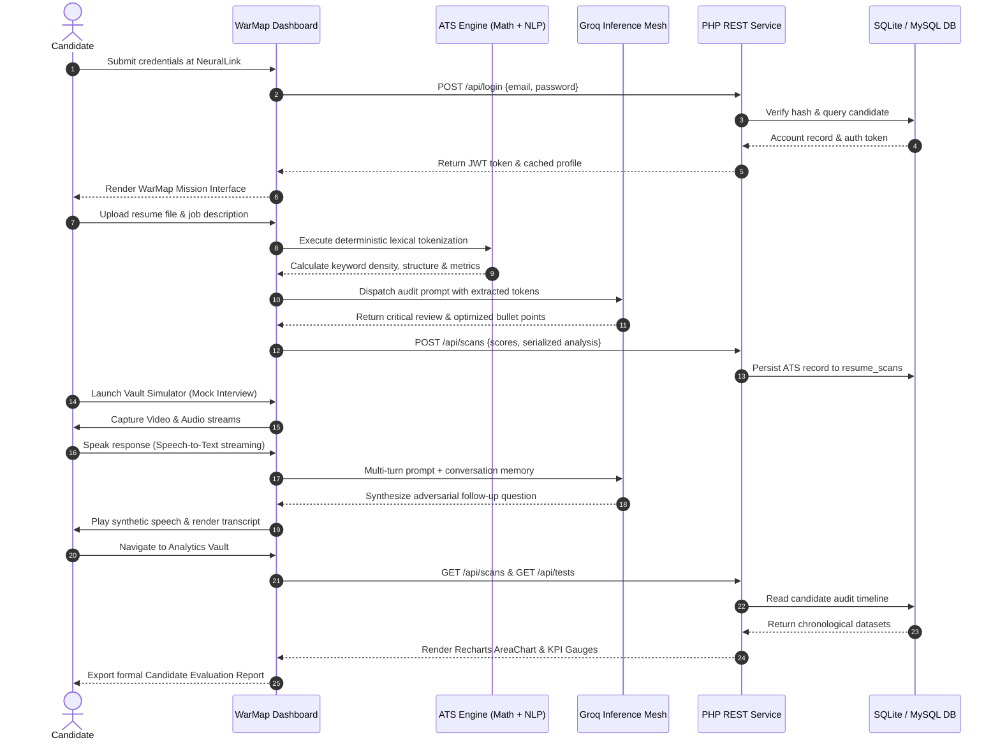

---

## 4. Deterministic ATS Scoring Equation & Weights

The ATS algorithm calculates an audit score bounded between `0` and `100` points using a four-factor deterministic equation coupled with LLM contextual validation:

<p align="center">
  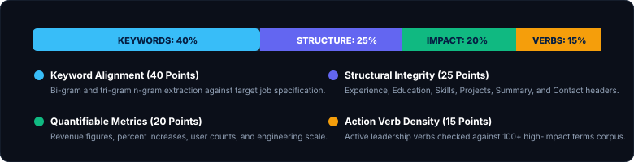
</p>

### Formula Definition

```text
Final ATS Score = (KeywordScore * 0.40) + (StructureScore * 0.25) + (ImpactScore * 0.20) + (VerbScore * 0.15)
```

Where:
- **KeywordScore**: Ratio of matched non-stopword n-grams against job requirements.
- **StructureScore**: Normalized detection of mandatory ATS section boundaries.
- **ImpactScore**: Metric density derived from occurrences of `[0-9]+%`, `\$[0-9]+[kKmMbB]?`, and scale integers.
- **VerbScore**: Density of active leadership power verbs initiating bullet points.

---

## 5. Module Matrix & Functional Specifications

The WarMap interface hosts nine specialized modules accessible via sidebar navigation and keyboard hotkeys (`Alt+1` through `Alt+9`):

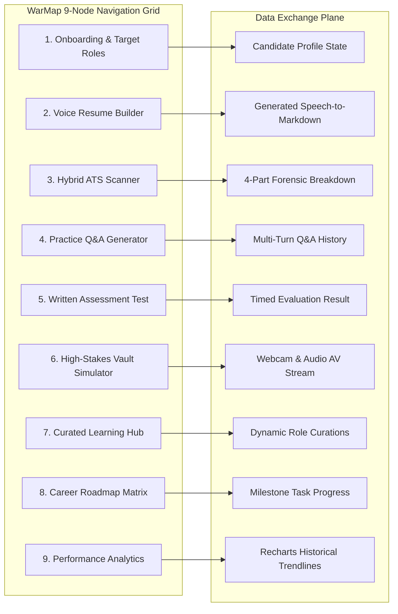

<details>
<summary><strong>Detailed Module Breakdown (Click to Expand)</strong></summary>

### Node 1: Onboarding (`ProfileSetup.tsx`)
- Captures candidate experience tiers: `Entry Level`, `Mid Level`, `Senior`, `Staff / Lead`, and `Principal`.
- Normalizes external platform handles: GitHub, LinkedIn, LeetCode, Codeforces, and portfolio domains.
- Dual-persists state into user-scoped `localStorage` keys and the backend `profiles` database table.

### Node 2: Voice Resume (`VoiceResumeBuilder.tsx`)
- 5-step guided wizard: resume presence check, text extractor, summary reviewer, social links, and oral questions.
- Browser SpeechRecognition pipeline with volume-reactive animated waveform visualizer.
- Generates compliant ATS markdown resumes with one-click clipboard copy and `.txt` blob export.

### Node 3: ATS Scanner (`ResumeBuilder.tsx`)
- Client-side drag-and-drop document upload with Base64 document parser.
- Deterministic 4-part scoring combined with Groq LLM deep forensic gap review.
- Suggests categorized missing skills across programming, aptitude, soft skills, and systems knowledge.

### Node 4: Practice Q&A (`QAGenerator.tsx`)
- Generates role-specific behavioral and technical interview questions based on candidate profile.
- Displays ideal answer outlines with bulleted evaluation criteria.
- Hosts an interactive follow-up chat thread beneath each question for conversational deep dives.

### Node 5: Written Test (`WrittenTest.tsx`)
- Dynamic MCQ examination generator across Coding, SQL, Aptitude, Verbal, and System Design topics.
- Automated client-side scoring engine with instant rationale display for incorrect selections.
- Automatically synchronizes finished test scores to the backend `test_scores` table.

### Node 6: Vault Simulator (`VaultSimulator.tsx`)
- Multi-round high-stakes simulator covering Technical, Behavioral, HR, and Role-Specific rounds.
- Video webcam streaming via `getUserMedia` with optional in-memory `MediaRecorder` video capture.
- Configurable countdown timer with animated pulse indicator.

### Node 7: Resource Finder (`ResourceFinder.tsx`)
- Pre-compiled engineering curriculum (System Design Primer, MDN Advanced JS, CS Interview University).
- Real-time client-side search query indexer filtering titles, descriptions, and domains.
- Groq AI integration dynamically discovering targeted resources matching candidate profile goals.

### Node 8: Career Roadmap (`CareerRoadmap.tsx`)
- Generates 5 distinct career progression milestones customized to candidate domain and seniority.
- Interactive task completion checklists with persistent state tracking.
- Visual milestone progression tracker calculating percentage readiness towards target roles.

### Node 9: Performance Analytics (`AnalyticsVault.tsx`)
- High-resolution Recharts historical AreaChart tracking readiness progression over time.
- KPI cards computing aggregate technical depth, readiness index, and assessment counts.
- Executive Candidate Evaluation Report generator supporting native print styles and JSON data export.

</details>

---

## 6. High-Frequency Interview Vault Architecture

The Vault Simulator operates as an integrated hardware and AI feedback loop:

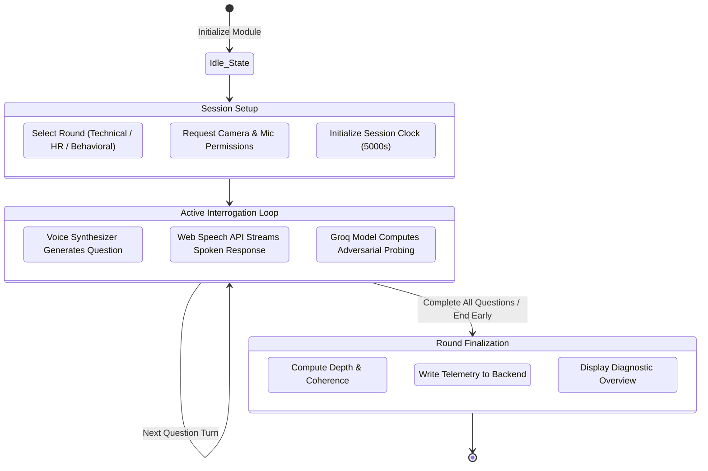

---

## 7. Dual-Engine Data Storage Topology

The platform provides complete operational capability in both online and air-gapped / offline configurations:

<p align="center">
  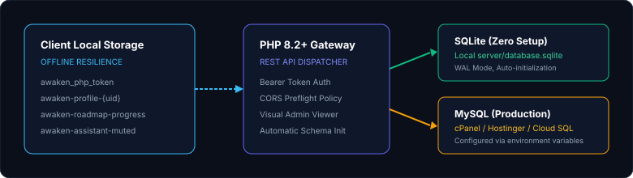
</p>

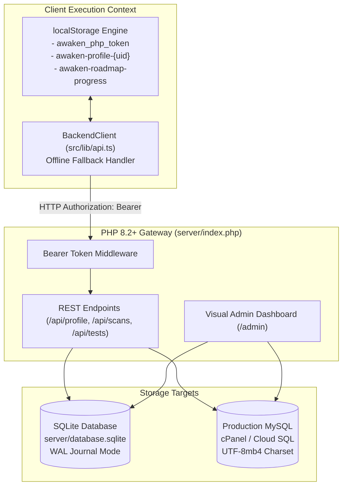

### Database Table Schemas

```sql
-- Users and authentication tokens
CREATE TABLE users (
    id VARCHAR(64) PRIMARY KEY,
    email VARCHAR(255) UNIQUE NOT NULL,
    password_hash VARCHAR(255) NOT NULL,
    display_name VARCHAR(255) NOT NULL,
    token VARCHAR(255),
    created_at TIMESTAMP DEFAULT CURRENT_TIMESTAMP,
    updated_at TIMESTAMP DEFAULT CURRENT_TIMESTAMP
);

-- Candidate profiles and career targets
CREATE TABLE profiles (
    user_id VARCHAR(64) PRIMARY KEY,
    full_name VARCHAR(255),
    phone VARCHAR(50),
    role VARCHAR(150),
    experience VARCHAR(100),
    domain VARCHAR(150),
    target_job VARCHAR(150),
    github VARCHAR(255),
    leetcode VARCHAR(255),
    linkedin VARCHAR(255),
    portfolio VARCHAR(255),
    updated_at TIMESTAMP DEFAULT CURRENT_TIMESTAMP
);

-- ATS diagnostic scan records
CREATE TABLE resume_scans (
    id INTEGER PRIMARY KEY AUTOINCREMENT,
    user_id VARCHAR(64),
    type VARCHAR(50),
    ats_score INTEGER,
    analysis_json TEXT,
    created_at TIMESTAMP DEFAULT CURRENT_TIMESTAMP
);

-- Domain assessment test evaluations
CREATE TABLE test_scores (
    id INTEGER PRIMARY KEY AUTOINCREMENT,
    user_id VARCHAR(64),
    topic VARCHAR(150),
    score INTEGER,
    created_at TIMESTAMP DEFAULT CURRENT_TIMESTAMP
);
```

---

## 8. Hardware & Browser Media Pipeline

The application interacts with browser hardware subsystems following strict permission protocols defined in `metadata.json`:

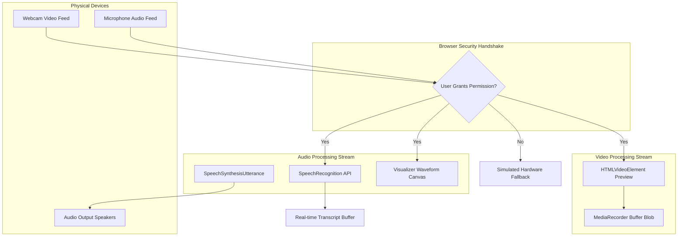

---

## 9. Quick Start & Execution Modes

### Prerequisites
- **Node.js**: `v18.0.0` or higher
- **PHP**: `v8.0.0` or higher with `pdo_sqlite` extension enabled
- **Groq API Key**: Free tier available from [console.groq.com](https://console.groq.com)

### Execution Matrix

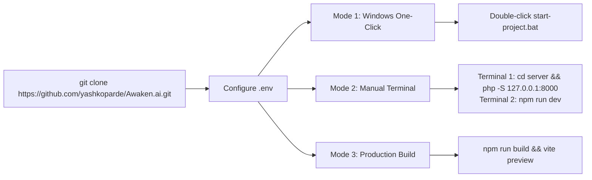

### Environment Variable Specification (`.env`)

```env
# Primary LLM API configuration (Groq Cloud)
VITE_GROQ_API_KEY="gsk_your_actual_groq_key_here"

# PHP Backend Gateway endpoint
VITE_PHP_API_URL="http://127.0.0.1:8000/api"

# Optional: Supabase credentials (fallback authentication)
VITE_SUPABASE_URL="https://your-project.supabase.co"
VITE_SUPABASE_ANON_KEY="your-supabase-anon-key"
```

---

## 10. Production Deployment Specifications

### Shared Hosting (Apache / cPanel)
1. Execute `npm run build` to generate the production artifact directory `dist/`.
2. Deploy the contents of `dist/` into your web server root (`public_html/`).
3. Deploy the `server/` directory into `public_html/api/`.
4. Configure database settings in `server/config.php` (set `DB_TYPE` to `mysql` for MySQL installations).
5. The included `server/.htaccess` file routes all `/api/*` endpoints through `server/index.php`.

### Static Edge Deployment (Netlify / Vercel)
- **Netlify**: Configuration managed via `netlify.toml` with single-page application redirect rules:
  ```toml
  [[redirects]]
    from = "/*"
    to = "/index.html"
    status = 200
  ```
- **Vercel**: Configuration managed via `vercel.json` routing all routes to index.

---

<p align="center">
  <sub>Architected and engineered by <a href="https://github.com/yashkoparde">yashkoparde</a>. Built for technical candidates navigating high-stakes interview processes.</sub>
</p>
