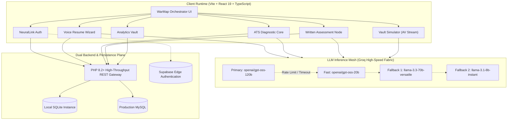

  <svg width="800" height="180" viewBox="0 0 800 180" fill="none" xmlns="http://www.w3.org/2000/svg">
    <rect width="800" height="180" rx="16" fill="#090D16"/>
    <defs>
      <linearGradient id="neon-cyan" x1="0%" y1="0%" x2="100%" y2="0%">
        <stop offset="0%" stop-color="#38BDF8"/>
        <stop offset="50%" stop-color="#6366F1"/>
        <stop offset="100%" stop-color="#A855F7"/>
      </linearGradient>
      <pattern id="dot-pattern" x="0" y="0" width="20" height="20" patternUnits="userSpaceOnUse">
        <circle cx="2" cy="2" r="1" fill="#334155" fill-opacity="0.4"/>
      </pattern>
    </defs>
    <rect width="800" height="180" rx="16" fill="url(#dot-pattern)"/>
    <path d="M 0 90 Q 200 40 400 90 T 800 90" stroke="url(#neon-cyan)" stroke-width="1.5" stroke-opacity="0.3" fill="none"/>
    <rect x="40" y="32" width="110" height="26" rx="6" fill="#1E293B" stroke="#334155" stroke-width="1"/>
    <text x="52" y="49" fill="#38BDF8" font-family="-apple-system, sans-serif" font-size="11" font-weight="700" letter-spacing="0.1em">SYSTEM CORE</text>
    <text x="40" y="105" fill="#FFFFFF" font-family="-apple-system, sans-serif" font-size="44" font-weight="900" letter-spacing="-0.03em">AWAKEN.AI</text>
    <text x="40" y="136" fill="#94A3B8" font-family="-apple-system, sans-serif" font-size="14" font-weight="500">Autonomous Interview Intelligence & High-Stakes Career Simulation Infrastructure</text>
    <circle cx="730" cy="90" r="42" stroke="#1E293B" stroke-width="2" fill="#0B132B"/>
    <circle cx="730" cy="90" r="28" stroke="#38BDF8" stroke-width="2" stroke-dasharray="6 4" fill="none"/>
    <circle cx="730" cy="90" r="8" fill="#6366F1"/>
    <line x1="688" y1="90" x2="772" y2="90" stroke="#334155" stroke-width="1"/>
    <line x1="730" y1="48" x2="730" y2="132" stroke="#334155" stroke-width="1"/>
  </svg>

  
  
  
  
  

---

## Technical Index

- [1. Architectural Foundation](#1-architectural-foundation)
- [2. Multi-Agent Topology](#2-multi-agent-topology)
- [3. Full System Interaction Flow](#3-full-system-interaction-flow)
- [4. Deterministic ATS Scoring Equation & Weights](#4-deterministic-ats-scoring-equation--weights)
- [5. Module Matrix & Functional Specifications](#5-module-matrix--functional-specifications)
- [6. High-Frequency Interview Vault Architecture](#6-high-frequency-interview-vault-architecture)
- [7. Dual-Engine Data Storage Topology](#7-dual-engine-data-storage-topology)
- [8. Hardware & Browser Media Pipeline](#8-hardware--browser-media-pipeline)
- [9. Quick Start & Execution Modes](#9-quick-start--execution-modes)
- [10. Production Deployment Specifications](#10-production-deployment-specifications)

---

## 1. Architectural Foundation

Awaken.ai is built as a dual-tier distributed interview coaching engine. It decouples high-throughput client-side audio/video processing from deterministic evaluation pipelines and distributed AI inference nodes.

---

## 2. Multi-Agent Topology

The platform coordinates five specialized neural agents configured with distinct system prompts, operational tones, and domain tasks:

  <svg width="780" height="230" viewBox="0 0 780 230" fill="none" xmlns="http://www.w3.org/2000/svg">
    <rect width="780" height="230" rx="12" fill="#0B0F19" stroke="#1E293B"/>
    <rect x="25" y="30" width="135" height="170" rx="10" fill="#0F172A" stroke="#38BDF8" stroke-width="1.5"/>
    <rect x="40" y="45" width="24" height="24" rx="6" fill="#0369A1"/>
    <text x="40" y="90" fill="#FFFFFF" font-family="-apple-system, sans-serif" font-size="13" font-weight="700">Orchestrator</text>
    <text x="40" y="108" fill="#38BDF8" font-family="-apple-system, sans-serif" font-size="10" font-weight="600">STATE HARMONY</text>
    <text x="40" y="130" fill="#94A3B8" font-family="-apple-system, sans-serif" font-size="9">Manages session cross-sync, module telemetry, and context persistence.</text>
    <rect x="175" y="30" width="135" height="170" rx="10" fill="#0F172A" stroke="#6366F1" stroke-width="1.5"/>
    <rect x="190" y="45" width="24" height="24" rx="6" fill="#4338CA"/>
    <text x="190" y="90" fill="#FFFFFF" font-family="-apple-system, sans-serif" font-size="13" font-weight="700">Auditor</text>
    <text x="190" y="108" fill="#818CF8" font-family="-apple-system, sans-serif" font-size="10" font-weight="600">ATS SCANNER</text>
    <text x="190" y="130" fill="#94A3B8" font-family="-apple-system, sans-serif" font-size="9">Forensically parses structure, action verbs, and skill density gap.</text>
    <rect x="325" y="30" width="135" height="170" rx="10" fill="#0F172A" stroke="#10B981" stroke-width="1.5"/>
    <rect x="340" y="45" width="24" height="24" rx="6" fill="#047857"/>
    <text x="340" y="90" fill="#FFFFFF" font-family="-apple-system, sans-serif" font-size="13" font-weight="700">Architect</text>
    <text x="340" y="108" fill="#34D399" font-family="-apple-system, sans-serif" font-size="10" font-weight="600">VOICE BUILDER</text>
    <text x="340" y="130" fill="#94A3B8" font-family="-apple-system, sans-serif" font-size="9">Converts spoken narrative and unstructured oral input to structured ATS resumes.</text>
    <rect x="475" y="30" width="135" height="170" rx="10" fill="#0F172A" stroke="#F43F5E" stroke-width="1.5"/>
    <rect x="490" y="45" width="24" height="24" rx="6" fill="#BE123C"/>
    <text x="490" y="90" fill="#FFFFFF" font-family="-apple-system, sans-serif" font-size="13" font-weight="700">Adversary</text>
    <text x="490" y="108" fill="#FB7185" font-family="-apple-system, sans-serif" font-size="10" font-weight="600">INTERVIEW SIM</text>
    <text x="490" y="130" fill="#94A3B8" font-family="-apple-system, sans-serif" font-size="9">Executes rigorous technical probing, dynamic pressure tests, and follow-ups.</text>
    <rect x="625" y="30" width="130" height="170" rx="10" fill="#0F172A" stroke="#F59E0B" stroke-width="1.5"/>
    <rect x="640" y="45" width="24" height="24" rx="6" fill="#B45309"/>
    <text x="640" y="90" fill="#FFFFFF" font-family="-apple-system, sans-serif" font-size="13" font-weight="700">Coach</text>
    <text x="640" y="108" fill="#FBBF24" font-family="-apple-system, sans-serif" font-size="10" font-weight="600">SPEECH ANALYTICS</text>
    <text x="640" y="130" fill="#94A3B8" font-family="-apple-system, sans-serif" font-size="9">Monitors answer conciseness, verbal filler rate, and vocal confidence signals.</text>
  </svg>

| Agent Identifier | Tactical Persona | Operational Tone | Primary Functionality | Core Dependency |
| :--- | :--- | :--- | :--- | :--- |
| `orchestrator` | System Orchestrator | Supportive | Synchronizes telemetry across all 9 WarMap tabs | `src/lib/agents.ts` |
| `forensic_auditor` | Resume Auditor | Analytical | Deconstructs resumes to compute structural & skill gaps | `src/lib/atsAlgorithm.ts` |
| `resume_architect` | Resume Architect | Supportive | Synthesizes oral responses into high-density ATS bullets | `src/lib/groq.ts` |
| `vault_adversary` | Mock Interviewer | Adversarial | Runs multi-turn high-stakes technical interrogation | `src/components/VaultSimulator.tsx` |
| `comm_coach` | Speech Coach | Analytical | Evaluates audio cadence, latency, and pacing metrics | Web Speech Recognition API |
