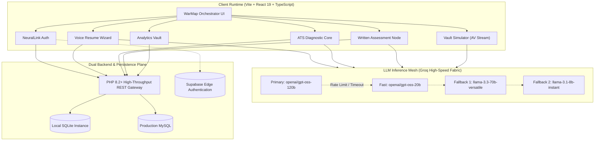
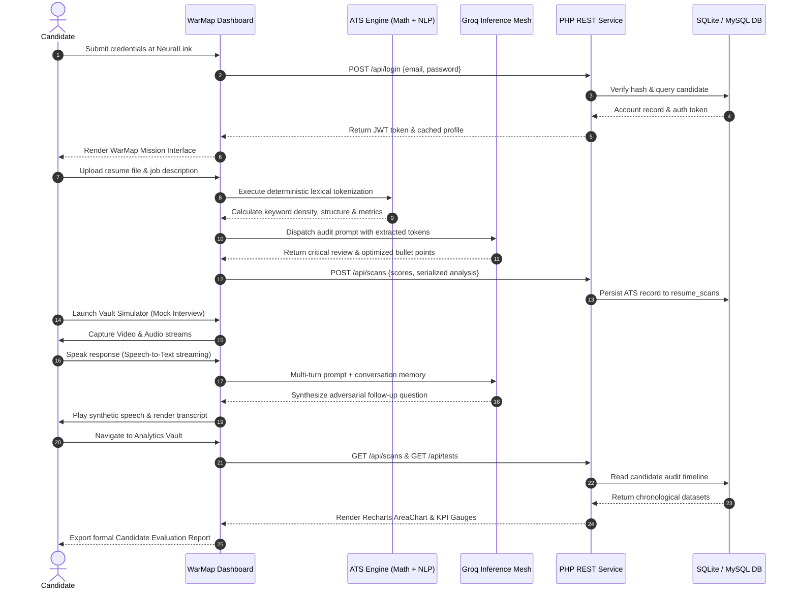
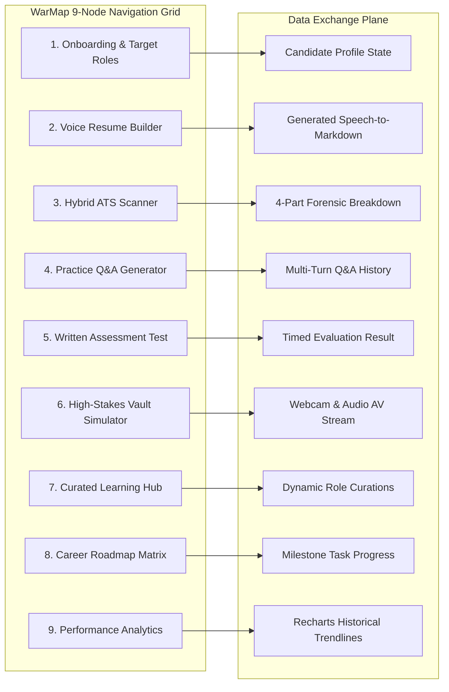
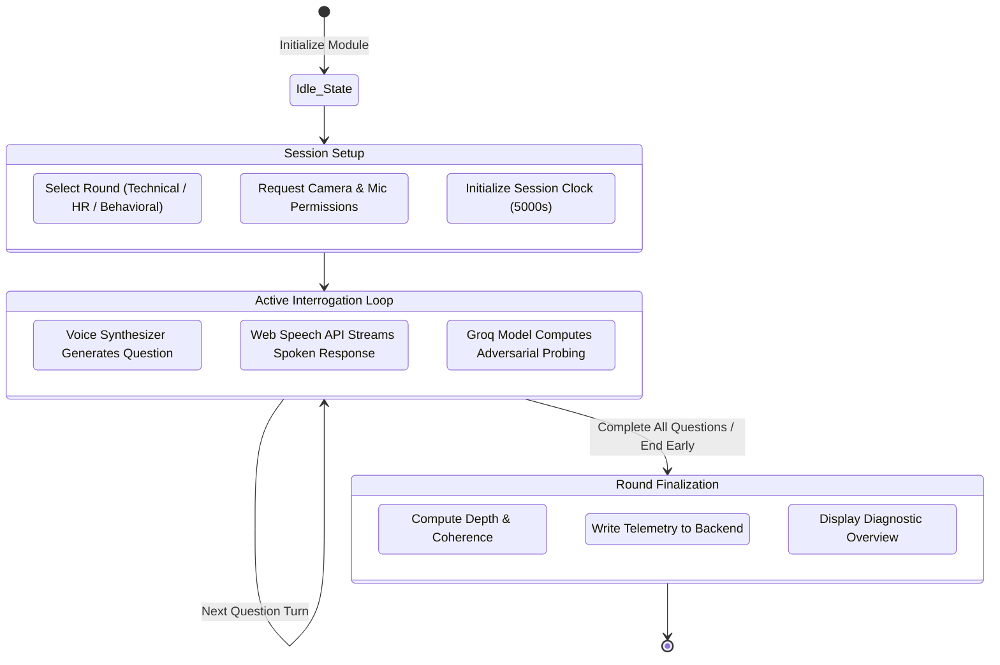

<p align="center">
  <svg width="800" height="180" viewBox="0 0 800 180" fill="none" xmlns="http://www.w3.org/2000/svg">
    <rect width="800" height="180" rx="16" fill="#090D16"/>
    <defs>
      <linearGradient id="neon-cyan" x1="0%" y1="0%" x2="100%" y2="0%">
        <stop offset="0%" stop-color="#38BDF8"/>
        <stop offset="50%" stop-color="#6366F1"/>
        <stop offset="100%" stop-color="#A855F7"/>
      </linearGradient>
      <pattern id="dot-pattern" x="0" y="0" width="20" height="20" patternUnits="userSpaceOnUse">
        <circle cx="2" cy="2" r="1" fill="#334155" fill-opacity="0.4"/>
      </pattern>
    </defs>
    <rect width="800" height="180" rx="16" fill="url(#dot-pattern)"/>
    <path d="M 0 90 Q 200 40 400 90 T 800 90" stroke="url(#neon-cyan)" stroke-width="1.5" stroke-opacity="0.3" fill="none"/>
    <rect x="40" y="32" width="110" height="26" rx="6" fill="#1E293B" stroke="#334155" stroke-width="1"/>
    <text x="52" y="49" fill="#38BDF8" font-family="-apple-system, sans-serif" font-size="11" font-weight="700" letter-spacing="0.1em">SYSTEM CORE</text>
    <text x="40" y="105" fill="#FFFFFF" font-family="-apple-system, sans-serif" font-size="44" font-weight="900" letter-spacing="-0.03em">AWAKEN.AI</text>
    <text x="40" y="136" fill="#94A3B8" font-family="-apple-system, sans-serif" font-size="14" font-weight="500">Autonomous Interview Intelligence & High-Stakes Career Simulation Infrastructure</text>
    <circle cx="730" cy="90" r="42" stroke="#1E293B" stroke-width="2" fill="#0B132B"/>
    <circle cx="730" cy="90" r="28" stroke="#38BDF8" stroke-width="2" stroke-dasharray="6 4" fill="none"/>
    <circle cx="730" cy="90" r="8" fill="#6366F1"/>
    <line x1="688" y1="90" x2="772" y2="90" stroke="#334155" stroke-width="1"/>
    <line x1="730" y1="48" x2="730" y2="132" stroke="#334155" stroke-width="1"/>
  </svg>
</p>

<p align="center">
  
  
  
  
  
</p>

---

## Technical Index

- [1. Architectural Foundation](#1-architectural-foundation)
- [2. Multi-Agent Topology](#2-multi-agent-topology)
- [3. Full System Interaction Flow](#3-full-system-interaction-flow)
- [4. Deterministic ATS Scoring Equation & Weights](#4-deterministic-ats-scoring-equation--weights)
- [5. Module Matrix & Functional Specifications](#5-module-matrix--functional-specifications)
- [6. High-Frequency Interview Vault Architecture](#6-high-frequency-interview-vault-architecture)
- [7. Dual-Engine Data Storage Topology](#7-dual-engine-data-storage-topology)
- [8. Hardware & Browser Media Pipeline](#8-hardware--browser-media-pipeline)
- [9. Quick Start & Execution Modes](#9-quick-start--execution-modes)
- [10. Production Deployment Specifications](#10-production-deployment-specifications)


---

## 1. Architectural Foundation

Awaken.ai is built as a dual-tier distributed interview coaching engine. It decouples high-throughput client-side audio/video processing from deterministic evaluation pipelines and distributed AI inference nodes.




---

## 2. Multi-Agent Topology

The platform coordinates five specialized neural agents configured with distinct system prompts, operational tones, and domain tasks:

<p align="center">
  <svg width="780" height="230" viewBox="0 0 780 230" fill="none" xmlns="http://www.w3.org/2000/svg">
    <rect width="780" height="230" rx="12" fill="#0B0F19" stroke="#1E293B"/>
    <rect x="25" y="30" width="135" height="170" rx="10" fill="#0F172A" stroke="#38BDF8" stroke-width="1.5"/>
    <rect x="40" y="45" width="24" height="24" rx="6" fill="#0369A1"/>
    <text x="40" y="90" fill="#FFFFFF" font-family="-apple-system, sans-serif" font-size="13" font-weight="700">Orchestrator</text>
    <text x="40" y="108" fill="#38BDF8" font-family="-apple-system, sans-serif" font-size="10" font-weight="600">STATE HARMONY</text>
    <text x="40" y="130" fill="#94A3B8" font-family="-apple-system, sans-serif" font-size="9">Manages session cross-sync, module telemetry, and context persistence.</text>
    <rect x="175" y="30" width="135" height="170" rx="10" fill="#0F172A" stroke="#6366F1" stroke-width="1.5"/>
    <rect x="190" y="45" width="24" height="24" rx="6" fill="#4338CA"/>
    <text x="190" y="90" fill="#FFFFFF" font-family="-apple-system, sans-serif" font-size="13" font-weight="700">Auditor</text>
    <text x="190" y="108" fill="#818CF8" font-family="-apple-system, sans-serif" font-size="10" font-weight="600">ATS SCANNER</text>
    <text x="190" y="130" fill="#94A3B8" font-family="-apple-system, sans-serif" font-size="9">Forensically parses structure, action verbs, and skill density gap.</text>
    <rect x="325" y="30" width="135" height="170" rx="10" fill="#0F172A" stroke="#10B981" stroke-width="1.5"/>
    <rect x="340" y="45" width="24" height="24" rx="6" fill="#047857"/>
    <text x="340" y="90" fill="#FFFFFF" font-family="-apple-system, sans-serif" font-size="13" font-weight="700">Architect</text>
    <text x="340" y="108" fill="#34D399" font-family="-apple-system, sans-serif" font-size="10" font-weight="600">VOICE BUILDER</text>
    <text x="340" y="130" fill="#94A3B8" font-family="-apple-system, sans-serif" font-size="9">Converts spoken narrative and unstructured oral input to structured ATS resumes.</text>
    <rect x="475" y="30" width="135" height="170" rx="10" fill="#0F172A" stroke="#F43F5E" stroke-width="1.5"/>
    <rect x="490" y="45" width="24" height="24" rx="6" fill="#BE123C"/>
    <text x="490" y="90" fill="#FFFFFF" font-family="-apple-system, sans-serif" font-size="13" font-weight="700">Adversary</text>
    <text x="490" y="108" fill="#FB7185" font-family="-apple-system, sans-serif" font-size="10" font-weight="600">INTERVIEW SIM</text>
    <text x="490" y="130" fill="#94A3B8" font-family="-apple-system, sans-serif" font-size="9">Executes rigorous technical probing, dynamic pressure tests, and follow-ups.</text>
    <rect x="625" y="30" width="130" height="170" rx="10" fill="#0F172A" stroke="#F59E0B" stroke-width="1.5"/>
    <rect x="640" y="45" width="24" height="24" rx="6" fill="#B45309"/>
    <text x="640" y="90" fill="#FFFFFF" font-family="-apple-system, sans-serif" font-size="13" font-weight="700">Coach</text>
    <text x="640" y="108" fill="#FBBF24" font-family="-apple-system, sans-serif" font-size="10" font-weight="600">SPEECH ANALYTICS</text>
    <text x="640" y="130" fill="#94A3B8" font-family="-apple-system, sans-serif" font-size="9">Monitors answer conciseness, verbal filler rate, and vocal confidence signals.</text>
  </svg>
</p>

| Agent Identifier | Tactical Persona | Operational Tone | Primary Functionality | Core Dependency |
| :--- | :--- | :--- | :--- | :--- |
| `orchestrator` | System Orchestrator | Supportive | Synchronizes telemetry across all 9 WarMap tabs | `src/lib/agents.ts` |
| `forensic_auditor` | Resume Auditor | Analytical | Deconstructs resumes to compute structural & skill gaps | `src/lib/atsAlgorithm.ts` |
| `resume_architect` | Resume Architect | Supportive | Synthesizes oral responses into high-density ATS bullets | `src/lib/groq.ts` |
| `vault_adversary` | Mock Interviewer | Adversarial | Runs multi-turn high-stakes technical interrogation | `src/components/VaultSimulator.tsx` |
| `comm_coach` | Speech Coach | Analytical | Evaluates audio cadence, latency, and pacing metrics | Web Speech Recognition API |


---

## 3. Full System Interaction Flow

The operational sequence illustrates how a candidate authenticates, conducts an ATS analysis, undergoes a simulated interview round, and compiles an executive evaluation report:




---

## 4. Deterministic ATS Scoring Equation & Weights

The ATS algorithm calculates an audit score bounded between `0` and `100` points using a four-factor deterministic equation coupled with LLM contextual validation:

<p align="center">
  <svg width="780" height="200" viewBox="0 0 780 200" fill="none" xmlns="http://www.w3.org/2000/svg">
    <rect width="780" height="200" rx="12" fill="#0B0F19" stroke="#1E293B"/>
    <rect x="40" y="35" width="700" height="28" rx="6" fill="#1E293B"/>
    <rect x="40" y="35" width="280" height="28" rx="6" fill="#38BDF8"/>
    <rect x="320" y="35" width="175" height="28" fill="#6366F1"/>
    <rect x="495" y="35" width="140" height="28" fill="#10B981"/>
    <rect x="635" y="35" width="105" height="28" rx="0 6 6 0" fill="#F59E0B"/>
    <text x="145" y="54" fill="#041E42" font-family="-apple-system, sans-serif" font-size="11" font-weight="800">KEYWORDS: 40%</text>
    <text x="365" y="54" fill="#FFFFFF" font-family="-apple-system, sans-serif" font-size="11" font-weight="800">STRUCTURE: 25%</text>
    <text x="525" y="54" fill="#041E42" font-family="-apple-system, sans-serif" font-size="11" font-weight="800">IMPACT: 20%</text>
    <text x="655" y="54" fill="#041E42" font-family="-apple-system, sans-serif" font-size="11" font-weight="800">VERBS: 15%</text>
    <g transform="translate(40, 85)">
      <circle cx="8" cy="8" r="6" fill="#38BDF8"/>
      <text x="22" y="12" fill="#FFFFFF" font-family="-apple-system, sans-serif" font-size="12" font-weight="700">Keyword Alignment (40 Points)</text>
      <text x="22" y="30" fill="#94A3B8" font-family="-apple-system, sans-serif" font-size="10">Bi-gram and tri-gram n-gram extraction against target job specification.</text>
      <circle cx="370" cy="8" r="6" fill="#6366F1"/>
      <text x="384" y="12" fill="#FFFFFF" font-family="-apple-system, sans-serif" font-size="12" font-weight="700">Structural Integrity (25 Points)</text>
      <text x="384" y="30" fill="#94A3B8" font-family="-apple-system, sans-serif" font-size="10">Experience, Education, Skills, Projects, Summary, and Contact headers.</text>
      <circle cx="8" cy="65" r="6" fill="#10B981"/>
      <text x="22" y="69" fill="#FFFFFF" font-family="-apple-system, sans-serif" font-size="12" font-weight="700">Quantifiable Metrics (20 Points)</text>
      <text x="22" y="87" fill="#94A3B8" font-family="-apple-system, sans-serif" font-size="10">Revenue figures, percent increases, user counts, and engineering scale.</text>
      <circle cx="370" cy="65" r="6" fill="#F59E0B"/>
      <text x="384" y="69" fill="#FFFFFF" font-family="-apple-system, sans-serif" font-size="12" font-weight="700">Action Verb Density (15 Points)</text>
      <text x="384" y="87" fill="#94A3B8" font-family="-apple-system, sans-serif" font-size="10">Active leadership verbs checked against 100+ high-impact terms corpus.</text>
    </g>
  </svg>
</p>

### Formula Definition

```text
Final ATS Score = (KeywordScore * 0.40) + (StructureScore * 0.25) + (ImpactScore * 0.20) + (VerbScore * 0.15)
```


---

## 5. Module Matrix & Functional Specifications

The WarMap interface hosts nine specialized modules accessible via sidebar navigation and keyboard hotkeys (`Alt+1` through `Alt+9`):



<details>
<summary><strong>Detailed Module Breakdown (Click to Expand)</strong></summary>

### Node 1: Onboarding (`ProfileSetup.tsx`)
- Captures candidate experience tiers: `Entry Level`, `Mid Level`, `Senior`, `Staff / Lead`, and `Principal`.
- Normalizes external platform handles: GitHub, LinkedIn, LeetCode, Codeforces, and portfolio domains.
- Dual-persists state into user-scoped `localStorage` keys and the backend `profiles` database table.

### Node 2: Voice Resume (`VoiceResumeBuilder.tsx`)
- 5-step guided wizard: resume presence check, text extractor, summary reviewer, social links, and oral questions.
- Browser SpeechRecognition pipeline with volume-reactive animated waveform visualizer.
- Generates compliant ATS markdown resumes with one-click clipboard copy and `.txt` blob export.

### Node 3: ATS Scanner (`ResumeBuilder.tsx`)
- Client-side drag-and-drop document upload with Base64 document parser.
- Deterministic 4-part scoring combined with Groq LLM deep forensic gap review.
- Suggests categorized missing skills across programming, aptitude, soft skills, and systems knowledge.

### Node 4: Practice Q&A (`QAGenerator.tsx`)
- Generates role-specific behavioral and technical interview questions based on candidate profile.
- Displays ideal answer outlines with bulleted evaluation criteria.
- Hosts an interactive follow-up chat thread beneath each question for conversational deep dives.

### Node 5: Written Test (`WrittenTest.tsx`)
- Dynamic MCQ examination generator across Coding, SQL, Aptitude, Verbal, and System Design topics.
- Automated client-side scoring engine with instant rationale display for incorrect selections.
- Automatically synchronizes finished test scores to the backend `test_scores` table.

### Node 6: Vault Simulator (`VaultSimulator.tsx`)
- Multi-round high-stakes simulator covering Technical, Behavioral, HR, and Role-Specific rounds.
- Video webcam streaming via `getUserMedia` with optional in-memory `MediaRecorder` video capture.
- Configurable countdown timer with animated pulse indicator.

### Node 7: Resource Finder (`ResourceFinder.tsx`)
- Pre-compiled engineering curriculum (System Design Primer, MDN Advanced JS, CS Interview University).
- Real-time client-side search query indexer filtering titles, descriptions, and domains.
- Groq AI integration dynamically discovering targeted resources matching candidate profile goals.

### Node 8: Career Roadmap (`CareerRoadmap.tsx`)
- Generates 5 distinct career progression milestones customized to candidate domain and seniority.
- Interactive task completion checklists with persistent state tracking.
- Visual milestone progression tracker calculating percentage readiness towards target roles.

### Node 9: Performance Analytics (`AnalyticsVault.tsx`)
- High-resolution Recharts historical AreaChart tracking readiness progression over time.
- KPI cards computing aggregate technical depth, readiness index, and assessment counts.
- Executive Candidate Evaluation Report generator supporting native print styles and JSON data export.

</details>


---

## 6. High-Frequency Interview Vault Architecture

The Vault Simulator operates as an integrated hardware and AI feedback loop:




---

## 7. Dual-Engine Data Storage Topology

The platform provides complete operational capability in both online and air-gapped / offline configurations:

<p align="center">
  <svg width="780" height="220" viewBox="0 0 780 220" fill="none" xmlns="http://www.w3.org/2000/svg">
    <rect width="780" height="220" rx="12" fill="#0B0F19" stroke="#1E293B"/>
    <rect x="30" y="30" width="210" height="160" rx="10" fill="#0F172A" stroke="#38BDF8"/>
    <text x="50" y="60" fill="#FFFFFF" font-family="-apple-system, sans-serif" font-size="13" font-weight="700">Client Local Storage</text>
    <text x="50" y="80" fill="#38BDF8" font-family="-apple-system, sans-serif" font-size="10">OFFLINE RESILIENCE</text>
    <text x="50" y="105" fill="#94A3B8" font-family="-apple-system, sans-serif" font-size="10">awaken_php_token</text>
    <text x="50" y="125" fill="#94A3B8" font-family="-apple-system, sans-serif" font-size="10">awaken-profile-{uid}</text>
    <text x="50" y="145" fill="#94A3B8" font-family="-apple-system, sans-serif" font-size="10">awaken-roadmap-progress</text>
    <text x="50" y="165" fill="#94A3B8" font-family="-apple-system, sans-serif" font-size="10">awaken-assistant-muted</text>
    <path d="M 240 110 L 290 110" stroke="#38BDF8" stroke-width="2" stroke-dasharray="4 2"/>
    <polygon points="290,105 300,110 290,115" fill="#38BDF8"/>
    <rect x="300" y="30" width="180" height="160" rx="10" fill="#0F172A" stroke="#6366F1"/>
    <text x="320" y="60" fill="#FFFFFF" font-family="-apple-system, sans-serif" font-size="13" font-weight="700">PHP 8.2+ Gateway</text>
    <text x="320" y="80" fill="#818CF8" font-family="-apple-system, sans-serif" font-size="10">REST API DISPATCHER</text>
    <text x="320" y="105" fill="#94A3B8" font-family="-apple-system, sans-serif" font-size="10">Bearer Token Auth</text>
    <text x="320" y="125" fill="#94A3B8" font-family="-apple-system, sans-serif" font-size="10">CORS Preflight Policy</text>
    <text x="320" y="145" fill="#94A3B8" font-family="-apple-system, sans-serif" font-size="10">Visual Admin Viewer</text>
    <text x="320" y="165" fill="#94A3B8" font-family="-apple-system, sans-serif" font-size="10">Automatic Schema Init</text>
    <path d="M 480 85 L 530 65" stroke="#10B981" stroke-width="2"/>
    <polygon points="530,60 539,64 532,70" fill="#10B981"/>
    <path d="M 480 135 L 530 155" stroke="#F59E0B" stroke-width="2"/>
    <polygon points="532,150 539,156 530,160" fill="#F59E0B"/>
    <rect x="540" y="30" width="210" height="70" rx="8" fill="#0F172A" stroke="#10B981"/>
    <text x="560" y="55" fill="#FFFFFF" font-family="-apple-system, sans-serif" font-size="12" font-weight="700">SQLite (Zero Setup)</text>
    <text x="560" y="72" fill="#34D399" font-family="-apple-system, sans-serif" font-size="10">Local server/database.sqlite</text>
    <text x="560" y="87" fill="#94A3B8" font-family="-apple-system, sans-serif" font-size="9">WAL Mode, Auto-initialization</text>
    <rect x="540" y="120" width="210" height="70" rx="8" fill="#0F172A" stroke="#F59E0B"/>
    <text x="560" y="145" fill="#FFFFFF" font-family="-apple-system, sans-serif" font-size="12" font-weight="700">MySQL (Production)</text>
    <text x="560" y="162" fill="#FBBF24" font-family="-apple-system, sans-serif" font-size="10">cPanel / Hostinger / Cloud SQL</text>
    <text x="560" y="177" fill="#94A3B8" font-family="-apple-system, sans-serif" font-size="9">Configured via environment variables</text>
  </svg>
</p>

### Database Table Schemas

```sql
-- Users and authentication tokens
CREATE TABLE users (
    id VARCHAR(64) PRIMARY KEY,
    email VARCHAR(255) UNIQUE NOT NULL,
    password_hash VARCHAR(255) NOT NULL,
    display_name VARCHAR(255) NOT NULL,
    token VARCHAR(255),
    created_at TIMESTAMP DEFAULT CURRENT_TIMESTAMP,
    updated_at TIMESTAMP DEFAULT CURRENT_TIMESTAMP
);

-- Candidate profiles and career targets
CREATE TABLE profiles (
    user_id VARCHAR(64) PRIMARY KEY,
    full_name VARCHAR(255),
    phone VARCHAR(50),
    role VARCHAR(150),
    experience VARCHAR(100),
    domain VARCHAR(150),
    target_job VARCHAR(150),
    github VARCHAR(255),
    leetcode VARCHAR(255),
    linkedin VARCHAR(255),
    portfolio VARCHAR(255),
    updated_at TIMESTAMP DEFAULT CURRENT_TIMESTAMP
);
```
